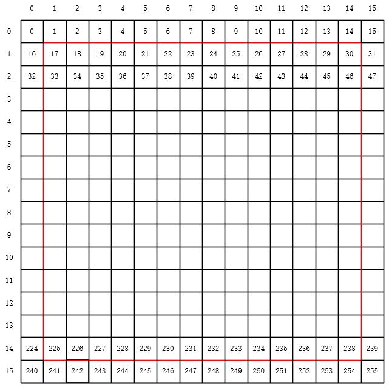
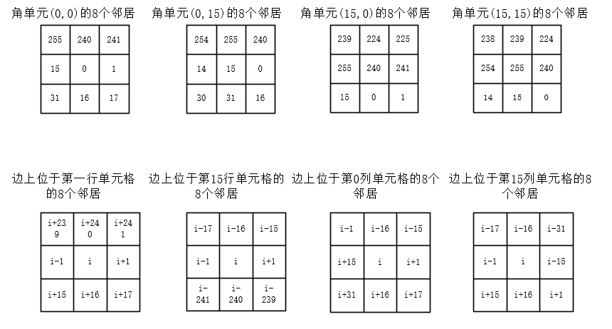

## Conway's Game of Life 16*16



```
由于在时序逻辑中循环可能在不同的周期内完成，所以我们使用generate来实现每个单元格在同一个clk内的状态变化；
① 确定每个单元格的位置i；
② 确定每个单元格的8个邻居的位置；
③ 统计8个邻居中状态为1的单元格个数

常规单元格获取对应q的8个邻居位置：
i-17	i-16	i-15
i-1		i		i+1
i+15	i+16	i+17
角单元单元格8个邻居的位置如下：
位于边但是非角的单元格的8个邻居的位置如下：
```

